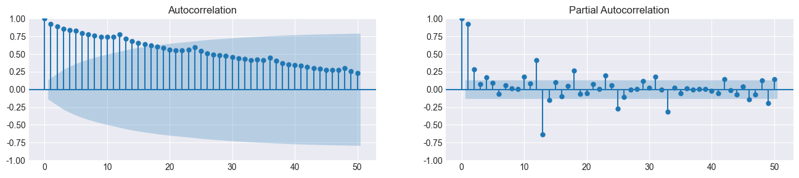
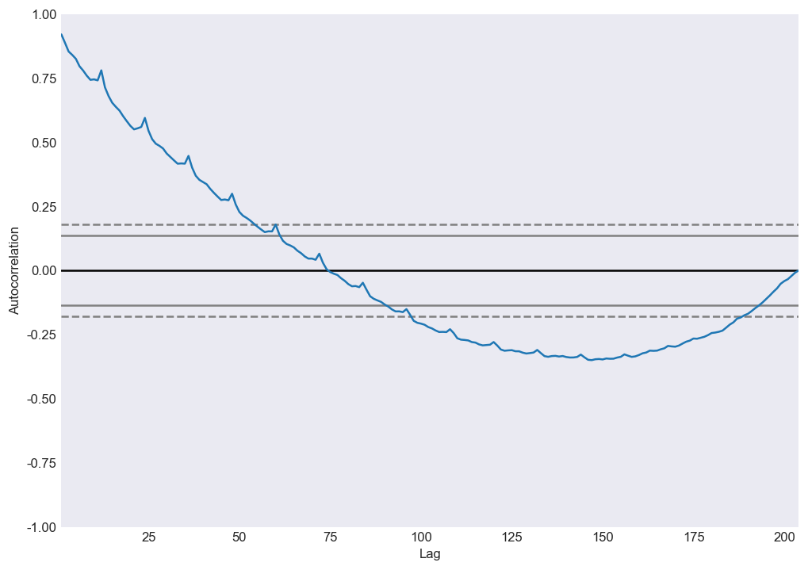
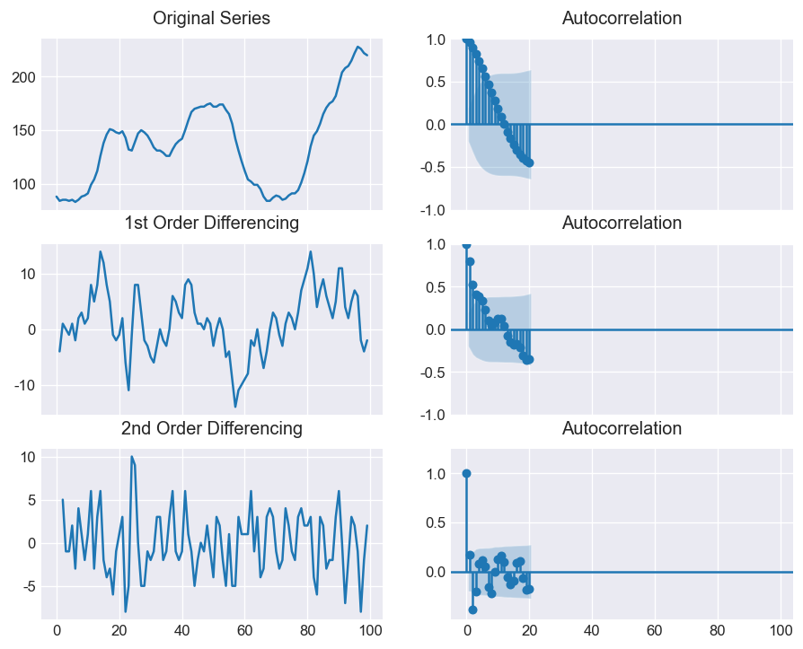

# 对于时间序列分析进行数学建模的一般性步骤

[TOC]


对于Python构建ARIMA模型,可以使用`pmdarima`库

> `pmdarima` brings R’s beloved `auto.arima` to Python, making an even stronger case for why you don’t need R for data science. `pmdarima` is 100% Python + Cython and does not leverage any R code, but is implemented in a powerful, yet easy-to-use set of functions & classes that will be familiar to scikit-learn users.


**简单来说,时间序列分析需要经过如下过程:**

1. 观察数据是否是**白噪声**:白噪声没有任何分析价值
2. 观察数据是否平稳:使用$ADF$和$KPSS$进行检验
3. 如果平稳:绘制$ACF$和$PACF$图像,观察$p-value$和$q-value$.
4. 如果非平稳:差分,直接使用`pd.value.diff()`,绘制图像,获取$(p,d,q)$值
5. 建立模型
6. 模型评估,预测


### 1. 导入数据

```python
pd.read_csv('https://raw.githubusercontent.com/selva86/datasets/master/sunspotarea.csv',parse_dates=['date'],index_col='date')
```

### 2.绘制图像观察序列的特点
```python
plt.plot(df)  # 对于时间序列,直接传入dataframe即可
```

### 3.时间序列的分解
+ 时间序列一般可以分解如下:
  + 加法分解:
    + val = base+trend+seasonal+\theta
  + 乘法分解:
    + val = base*trend*seasonal*\theta
+ 使用`from statsmodel.tsa.seasonal import seasonal_decompose`可以对时间序列分解进行乘法分解和加法分解,代码如下:
```python
result_mul = seasonal_decompose(df['value'], model='multiplicative', extrapolate_trend='freq')  #乘法分解
result_add = seasonal_decompose(df['value'], model='additive', extrapolate_trend='freq')
```
`seasonal_decompose()`函数返回元组,其中包含:
+   trend
+ seasonal
+ resid

借助该函数,我们可以绘制去季节化,去趋势化的时间序列图像
1. 去季节化
```python
plt.plot((df.value.values/result_mul.seasonal))
plt.title('时间序列去季节化')
```
2. 去趋势化
```python
detrended = df.value.values - result_mul.trend        # 除以trend会产生所有的年份的销售额期望值均相同的效果
plt.plot(detrended)
plt.title('通过最小二乘拟合来使时间序列去趋势化', fontsize=16)
```

#### 检验时间序列的季节性
使用自相关系数:autocorrelation:
`from pandas.plotting import autocorrelation_plot`

### 4. 检验时间序列是否平稳
最常用的检验方式有两种:$ADF$检验,$KPSS$检验
+ $ADF$检验的零假设为序列非平稳,当$p<0.05$时拒绝零假设.也就是说,当我们对序列进行$adf$检验所得结果>0.05时,该序列为非平稳序列
+ $KPSS$检验的零假设为序列平稳,当$p<0.05$时,拒绝零假设.也即是说,当$KPSS$检验所得$p value<0.05$时,序列非平稳
```python
from statsmodels.tsa.stattools import adfuller, kpss
df = pd.read_csv('https://raw.githubusercontent.com/selva86/datasets/master/a10.csv', parse_dates=['date'])

# ADF Test
result = adfuller(df.value.values, autolag='AIC')
print(f'ADF Statistic: {result[0]}')
print(f'p-value: {result[1]}')
for key, value in result[4].items():
    print('Critial Values:')
    print(f'   {key}, {value}')

# KPSS Test
result = kpss(df.value.values, regression='c')
print('\nKPSS Statistic: %f' % result[0])
print('p-value: %f' % result[1])
for key, value in result[3].items():
    print('Critial Values:')
    print(f'   {key}, {value}')
ADF Statistic: 3.14518568930674
p-value: 1.0
Critial Values:
   1%, -3.465620397124192
Critial Values:
   5%, -2.8770397560752436
Critial Values:
   10%, -2.5750324547306476

KPSS Statistic: 1.313675
p-value: 0.010000
Critial Values:
   10%, 0.347
Critial Values:
   5%, 0.463
Critial Values:
   2.5%, 0.574
Critial Values:
   1%, 0.739
```


### 5. 处理时间序列之中的缺失值.
有如下方法:
向后填充；
线性内插；
二次内插；
最邻近平均值；
对应季节的平均值。

```python
# # Generate dataset
from scipy.interpolate import interp1d
from sklearn.metrics import mean_squared_error

df_orig = pd.read_csv('https://raw.githubusercontent.com/selva86/datasets/master/a10.csv', parse_dates=['date'],
                      index_col='date').head(100)
df = pd.read_csv('datasets/a10_missings.csv', parse_dates=['date'], index_col='date')

fig, axes = plt.subplots(7, 1, sharex=True, figsize=(10, 12))
plt.rcParams.update({'xtick.bottom': False})

## 1. Actual -------------------------------
df_orig.plot(title='Actual', ax=axes[0], label='Actual', color='red', style=".-")
df.plot(title='Actual', ax=axes[0], label='Actual', color='green', style=".-")
axes[0].legend(["Missing Data", "Available Data"])

## 2. Forward Fill --------------------------
df_ffill = df.ffill()
error = np.round(mean_squared_error(df_orig['value'], df_ffill['value']), 2)
df_ffill['value'].plot(title='Forward Fill (MSE: ' + str(error) + ")", ax=axes[1], label='Forward Fill', style=".-")

## 3. Backward Fill -------------------------
df_bfill = df.bfill()
error = np.round(mean_squared_error(df_orig['value'], df_bfill['value']), 2)
df_bfill['value'].plot(title="Backward Fill (MSE: " + str(error) + ")", ax=axes[2], label='Back Fill',
                       color='firebrick', style=".-")

## 4. Linear Interpolation ------------------
df['rownum'] = np.arange(df.shape[0])
df_nona = df.dropna(subset=['value'])
f = interp1d(df_nona['rownum'], df_nona['value'])
df['linear_fill'] = f(df['rownum'])
error = np.round(mean_squared_error(df_orig['value'], df['linear_fill']), 2)
df['linear_fill'].plot(title="Linear Fill (MSE: " + str(error) + ")", ax=axes[3], label='Cubic Fill', color='brown',
                       style=".-")

## 5. Cubic Interpolation --------------------
f2 = interp1d(df_nona['rownum'], df_nona['value'], kind='cubic')
df['cubic_fill'] = f2(df['rownum'])
error = np.round(mean_squared_error(df_orig['value'], df['cubic_fill']), 2)
df['cubic_fill'].plot(title="Cubic Fill (MSE: " + str(error) + ")", ax=axes[4], label='Cubic Fill', color='red',
                      style=".-")


# Interpolation References:
# https://docs.scipy.org/doc/scipy/reference/tutorial/interpolate.html
# https://docs.scipy.org/doc/scipy/reference/interpolate.html

## 6. Mean of 'n' Nearest Past Neighbors ------
def knn_mean(ts, n):
    out = np.copy(ts)
    for i, val in enumerate(ts):
        if np.isnan(val):
            n_by_2 = np.ceil(n / 2)
            lower = np.max([0, int(i - n_by_2)])
            upper = np.min([len(ts) + 1, int(i + n_by_2)])
            ts_near = np.concatenate([ts[lower:i], ts[i:upper]])
            out[i] = np.nanmean(ts_near)
    return out


df['knn_mean'] = knn_mean(df.value.values, 8)
error = np.round(mean_squared_error(df_orig['value'], df['knn_mean']), 2)
df['knn_mean'].plot(title="KNN Mean (MSE: " + str(error) + ")", ax=axes[5], label='KNN Mean', color='tomato', alpha=0.5,
                    style=".-")


## 7. Seasonal Mean ----------------------------
def seasonal_mean(ts, n, lr=0.7):
    """
    Compute the mean of corresponding seasonal periods
    ts: 1D array-like of the time series
    n: Seasonal window length of the time series
    """
    out = np.copy(ts)
    for i, val in enumerate(ts):
        if np.isnan(val):
            ts_seas = ts[i - 1::-n]  # previous seasons only
            if np.isnan(np.nanmean(ts_seas)):
                ts_seas = np.concatenate([ts[i - 1::-n], ts[i::n]])  # previous and forward
            out[i] = np.nanmean(ts_seas) * lr
    return out


df['seasonal_mean'] = seasonal_mean(df.value, n=12, lr=1.25)
error = np.round(mean_squared_error(df_orig['value'], df['seasonal_mean']), 2)
df['seasonal_mean'].plot(title="Seasonal Mean (MSE: " + str(error) + ")", ax=axes[6], label='Seasonal Mean',
                         color='blue', alpha=0.5, style=".-")
```


### 6. 自相关和偏自相关函数

自相关函数和偏自相关函数是时间序列数学建模之中最重要的步骤之一

#### 自相关函数

+ 自相关函数的定义:
> 自相关（英语：Autocorrelation），也叫序列相关，是一个信号于其自身在不同时间点的互相关。非正式地来说，它就是两次观察之间的相似度对它们之间的时间差的函数。它是找出重复模式（如被噪声掩盖的周期信号），或识别隐含在信号谐波频率中消失的基频的数学工具。它常用于信号处理中，用来分析函数或一系列值，如时域信号。

数学定义:

$r(Z_{t-k},Z_t)=Cov(X_{t-k},X_t)/\sqrt{Var(X_{t-k})Var(X_t)}$

+ 序列的自相关系数以及偏自相关系数图像,使用如下代码生成:

```python
from statsmodel.graphics.tsaplots import plot_acf,plotpacf


# Draw Plot
fig, axes = plt.subplots(1, 2, figsize=(16, 3), dpi=100)
plot_acf(df.value.values, lags=50, ax=axes[0])
plot_pacf(df.value.values, lags=50, ax=axes[1])
```


+ 




+ 自相关系数的应用:
    + 判断时间序列是否是白噪声:对于白噪声,其自相关系数在不同的`lag`数值下,均为0.实际中,如果样本的自相关系数近似为0,那么我们就可以认为该序列为白噪声序列
    + 对于单调递增的非平稳序列,一般会有如下形式的自相关图象:先是在相当长的一段时间内r>0,而后又一直为负.总体上单调递减,呈三角对称性.
    + 如果自相关系数长期位于0轴的一边,且成正弦波动规律.这是具有周期变化规律的非平稳序列的典型特征
    + 如果自相关系数一直比较小,且始终控制在两倍标准差范围以内.可以推测原序列为随机性非常强的平稳时间序列

#### 偏自相关函数


#### Lag Plot

Lag Plot 也称滞后图.

> A lag plot checks whether a data set or time series is random or not. Random data should not exhibit any identifiable structure in the lag plot. Non-random structure in the lag plot indicates that the underlying data are not random.

[滞后图的解读](https://www.itl.nist.gov/div898/handbook/eda/section3/lagplot.htm)


该图形表示原始时间序列为白噪音,或者说是随即序列.我们无法对该序列做下一步的处理


该图形表示原始序列为 弱自相关序列(weak autocorrelation),使用如下方程对其建模:理论上我们可以使用linear regression对其进行回归分析

$Y_i = A_0+A_1*Y_{i-1}+E_i$


1. The data come from an underlying autoregressive model with strong positive autocorrelation
2. The data contain no outliers.
3.  Note the tight clustering of points along the diagonal. This is the lag plot signature of a process with strong positive autocorrelation. Such processes are highly non-random--there is strong association between an observation and a succeeding observation.
4. model:

$\begin{equation}{Y_i = A_0+A_1*Y_{i-1}+E_i}\end{equation}$

5. ​	residual standard deviation:

$Y_i = A_0+E_i$


1. 可以推测图像来自单周期正弦函数
2. 模型如下: $Y_i = C+\alpha sin(2\pi \omega+\phi)+E_i$
3. 可以忽略异常值


1. 当lag plot呈现正弦特征时,可以推测原始数据有**季节性**特征


### 7. 建模:ARIMA模型

[ARIMA Model - Complete Guide to Time Series Forecasting in Python | ML+ (machinelearningplus.com)](https://www.machinelearningplus.com/time-series/arima-model-time-series-forecasting-python/)

建立$ARIMA(p,d,q)$模型最终的几个参数:

> Non-seasonal ARIMA models are generally denoted `ARIMA(p,d,q)` where parameters `p`, `d`, and `q` are non-negative integers, `p` is the order (number of time lags) of the autoregressive model, `d` is the degree of differencing (the number of times the data have had past values subtracted), and `q` is the order of the moving-average model.

#### AR模型

AR:即Auto regression,自回归.$Y_t$ depends only on its own lags.

AR模型的方程:$Y_t = \alpha+Y_t+\mu_1 Y_{t-1}+\mu_2 Y_{t-2}+...+\mu_q Y_{t-q},$其中,$\epsilon_t$表示误差项.

其中,参数$q$等于pacf图像之中$lag$最初收敛到$95\%$置信区间的值

对于一个$AR(1)$模型而言:

+ 当$\mu_1 = 0$时,$Y_t$相当于白噪声.
+ 当$\mu_1 = 1$且$\alpha = 0$时,$Y_t$相当于随机游走模型
+ 当$\mu_1 = 1$且$\alpha \not=0$时,$Y_t$相当于带漂移的随机游走模型
+ 当$\mu_1 < 0$时,$Y_t$在正负值之间上下浮动

#### MA模型

$MA$,即moving average模型.使用历史预测五擦黄来建立一个类似回归的模型.即$q$阶移动平均模型.方程如下:

$Y_t = c + \epsilon_t+\theta_1 \epsilon_{t-1}+\theta_2 \epsilon_{t-2}+...+\theta_q \epsilon_{t-q}$

其中,$\epsilon_t$表示白噪声.

其中,$q$由$ACF$图像之中tag阶段的结束决定.具体见下表.


|        | $AR(p)$   | $MA(q)$   | $ARMA(p,d,q)$ |
| ------ | --------- | --------- | ------------- |
| $ACF$  | 拖尾      | q阶后截断 | 拖尾          |
| $PACF$ | p阶后截断 | 拖尾      | 拖尾          |


当$ACF$以及$PACF$图像均不截断(或者阶段结束>10)时,我们需要对序列进行差分处理.直接使用`dataframe.value.diff()`进行处理即可.多次差分观察序列图像,$ACF$以及$PACF$图像,获取$(p,d,q)$数值.



观察上图,原始图像以及1阶差分均无法stationary,进行到二阶差分时,pacf图像截断.但是lag = 3时,直接跑到了0轴之下很远.所以我们应该考虑使用1作为差分阶数$d$

使用`pmdarima.arima.utils`也可以直接得到$d$,如下:

```pyhton
from pmdarima.arima.utils import ndiffs
df = pd.read_csv('https://raw.githubusercontent.com/selva86/datasets/master/wwwusage.csv', names=['value'], header=0)
y = df.value

## Adf Test
ndiffs(y, test='adf')  # 2

# KPSS test
ndiffs(y, test='kpss')  # 0

# PP test:
ndiffs(y, test='pp')  # 2
```


#### 建立ARIMA模型

```python
from statsmodels.tsa.arima_model import ARIMA

# 1,1,2 ARIMA Model
model = ARIMA(df.value, order=(1,1,2))
model_fit = model.fit(disp=0)
print(model_fit.summary())
```

也可以使用`pmdarima`直接进行建模

使用`statsmodel`进行建模所得结果如下:

```python
                             ARIMA Model Results                              
==============================================================================
Dep. Variable:                D.value   No. Observations:                   99
Model:                 ARIMA(1, 1, 2)   Log Likelihood                -253.790
Method:                       css-mle   S.D. of innovations              3.119
Date:                Wed, 06 Feb 2019   AIC                            517.579
Time:                        23:32:56   BIC                            530.555
Sample:                             1   HQIC                           522.829

=================================================================================
                    coef    std err          z      P>|z|      [0.025      0.975]
---------------------------------------------------------------------------------
const             1.1202      1.290      0.868      0.387      -1.409       3.649
ar.L1.D.value     0.6351      0.257      2.469      0.015       0.131       1.139
ma.L1.D.value     0.5287      0.355      1.489      0.140      -0.167       1.224
ma.L2.D.value    -0.0010      0.321     -0.003      0.998      -0.631       0.629
                                    Roots                                    
=============================================================================
                  Real          Imaginary           Modulus         Frequency
-----------------------------------------------------------------------------
AR.1            1.5746           +0.0000j            1.5746            0.0000
MA.1           -1.8850           +0.0000j            1.8850            0.5000
MA.2          545.3515           +0.0000j          545.3515            0.0000
-----------------------------------------------------------------------------
```

**参数解读**

一个良好的ARIMA模型之中,$P>|z|$一栏之中的各项数值均应该小于$0.05$.同时参数$AIC$也可以衡量模型的优劣.通常,$AIC$的数值越小越好.


### 8.Holt-Winters模型


